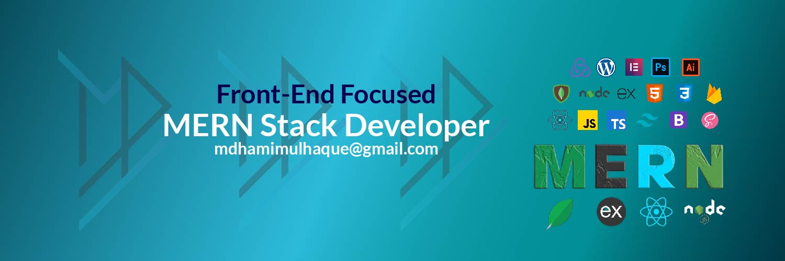

<h1 align="center">Hi 👋, I'm Md Hamimul Haque</h1>
<h3 align="center">A Front-End focused MERN Developer</h3>

- 🔭 I’m currently working on [KnowledgeTunes](https://knowledgetunes-13b9a.web.app/?fbclid=IwAR3mXTZPRQ4bTB9LfhUbl_o3MK-CnZkNTnqb8kSnlPK-7RGcaJj1M9rG3Fs)

- 🌱 I’m currently learning **TypeScript, Redux, GraphQL**

- 👯 I’m looking to collaborate on **Open Source Projects**

- 📫 How to reach me **mdhamimulhaque@gmail.com**

- 📄 Know about my experiences [Resume](https://drive.google.com/file/d/168t8ONZyO3TO6fasjZWfi4WvNOHZlKfF/view?fbclid=IwAR1zyitfmj0ZOYfX3TQmAi_eZ26TdT0NG_klr-9fDItYSdltPSskq4zZ8KQ)

- ⚡ Fun fact **I love to play with children's.**

<h3 align="left">Connect with me:</h3>

<h3 align="left">Languages and Tools:</h3>

 
 
 

  

